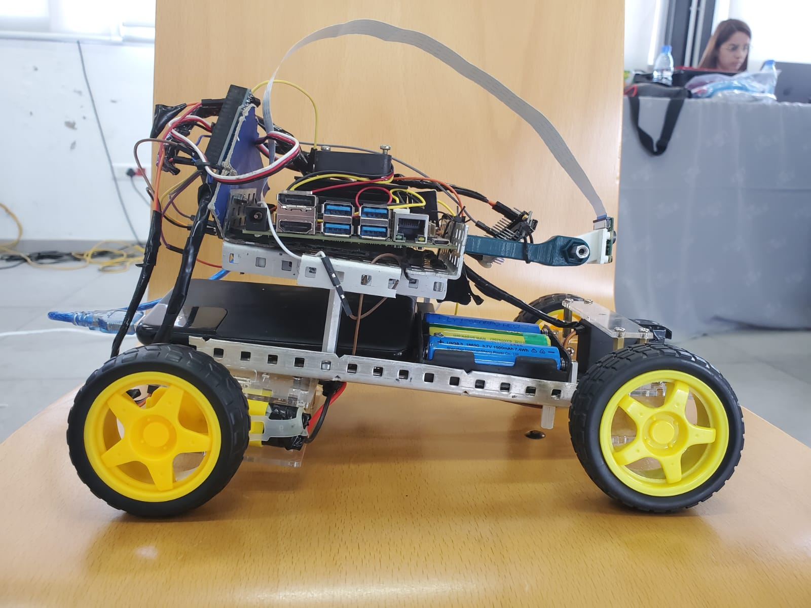

<div align="center">

# Brainiacs Autonomous Vehicle (WRO Future Engineers 2023)

An end‑to‑end open hardware + software autonomous race vehicle built in **20 days** for the WRO Future Engineers challenge. Combines embedded control, sensor fusion, and Jetson‑powered computer vision.



</div>

---

## 🔎 Quick Overview
| Domain | Stack |
|--------|-------|
| High‑Level Compute | NVIDIA Jetson Nano (Python / OpenCV) |
| Real‑Time Control | Arduino Mega + Nano (C++ / PID) |
| Perception Sensors | Raspberry Pi Cam v2.1, TCS34725 Color, MPU6050 IMU |
| Actuation | Brushless DC Motor, Geared Steering Servo, L298N Driver |
| Power | 5× 18650 Li‑Ion Cells |

> Goal: Reliably detect corners & signs, execute smooth pathing with PID steering & speed modulation.

---

## 🧭 Repository Map
| Path | Purpose |
|------|---------|
| `src/` | Firmware & vision code (Arduino + Jetson) |
| `docs/` | Extended documentation (hardware, software, media) |
| `models/` | 3D printable / CNC model files |
| `schemes/` | Wiring / electronic schematic PNG |
| `t-photos/` | Team photos |
| `v-photos/` | Vehicle reference photos |
| `Project Report/` | Formal competition project report |
| `CONTRIBUTING.md` | How to help extend the project |

---

## 🚀 Key Features
* Jetson‑based traffic sign & marker detection pipeline.
* Deterministic Arduino control loop with PID steering stabilization using IMU feedback.
* Color sensor driven corner recognition for track turning logic.
* Modular dual‑MCU design (Mega primary, Nano auxiliary potential expansion).
* Clear calibration steps for IMU bias, color thresholds & PID tuning.

---

## 🧩 System Architecture
```
   Camera --> Jetson (Python CV) --> STEER / EVENT cmds -->
                                             +----------------------+
 Color Sensor --> Arduino Mega (PID loop) -->| Motor Driver (L298N) |--> Drive Motor
       IMU --> (Sensor Fusion)               +----------------------+
                                 --> Servo (Steering)
```

See `docs/software` and `docs/hardware` for deeper diagrams and flow descriptions.

---

## 🛠 Hardware (Core List)
- Jetson Nano
- Arduino Mega 2560 & Arduino Nano
- Raspberry Pi Camera v2.1
- Brushless DC Motor + Geared Steering Servo
- L298N Dual H‑Bridge Motor Driver
- MPU6050 IMU (orientation + rate for PID)
- TCS34725 Color Sensor (corner & marker detection)
- 5× 18650 Cells (regulated rails; common ground)

Full bill of materials with notes: `docs/hardware/README.md`.

---

## 💻 Software Components
| Component | Location | Notes |
|-----------|----------|-------|
| Vision / Sign Detection | `src/Jetson Code/main.py` | OpenCV pipeline, serial out commands |
| Mega Control Firmware | `src/ArduinoMegaCodeV1.0` | Main loop: sensors, PID, actuation |
| Nano Firmware | `src/ArduinoNanoCodeV1.0` | Expansion / auxiliary logic (future) |
| Libraries Snapshot | `src/Arduino Libraries/` | Vendor libs for reproducibility |

---

## 🔧 Setup & Getting Started
### 1. Clone
```bash
git clone https://github.com/<your-org-or-user>/Brainiacs-Future-Engineers-2023.git
cd Brainiacs-Future-Engineers-2023
```
### 2. Arduino Firmware
1. Open the `.ino` in the Arduino IDE (Board: Mega 2560).
2. Install libraries if not auto‑resolved (color sensor, IMU, Servo). Snapshot included under `src/Arduino Libraries`.
3. Upload and open Serial Monitor for telemetry.

### 3. Jetson Vision Stack
Install dependencies (example):
```bash
sudo apt update
sudo apt install -y python3-opencv python3-numpy
python3 src/'Jetson Code'/main.py
```

### 4. Wiring
Reference: `schemes/Schematic circuit .png` and `docs/hardware` notes.

---

## ⚙️ Calibration Workflow
| Step | Purpose | Method |
|------|---------|--------|
| IMU Bias | Remove static drift | Average N samples at startup |
| PID Tune | Stable steering | Increase P to oscillation threshold, add D to damp |
| Color Thresholds | Reliable corner detect | Sample track under lighting, store RGB/temperature |
| Vision Thresholds | Clean sign detection | Adjust HSV / contour filters on sample frames |

---

## 📸 Media & Demo
See gallery in `v-photos/` & team in `t-photos/`.
Add / update demo video link in `docs/media/` (create a `video.md`).

---

## 🛣 Roadmap / Ideas
- [ ] Lightweight CNN for sign recognition
- [ ] On‑device telemetry logging (CSV)
- [ ] Configurable PID over serial shell
- [ ] Wheel encoder integration for velocity control
- [ ] Safety watchdog & failsafe braking

---

## 🤝 Contributing
Guidelines in `CONTRIBUTING.md`. PRs welcome—focus on clarity, reproducibility & incremental improvements.

---

## 📄 License
This project is licensed under the MIT License – see the [`LICENSE`](./LICENSE) file for details.

---

## 🙌 Acknowledgements
Built by Team Brainiacs for WRO Future Engineers 2023. Thanks to the open‑source community and library authors whose work accelerated development.

---

## Legacy Notes (Original Summary)
The project was rapidly developed in 20 days integrating PID steering, color-based corner detection, and Jetson Nano computer vision for traffic sign interaction. Documentation has since been reorganized for clarity and future contributions.
